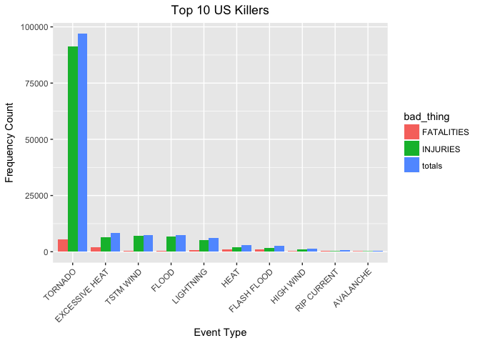
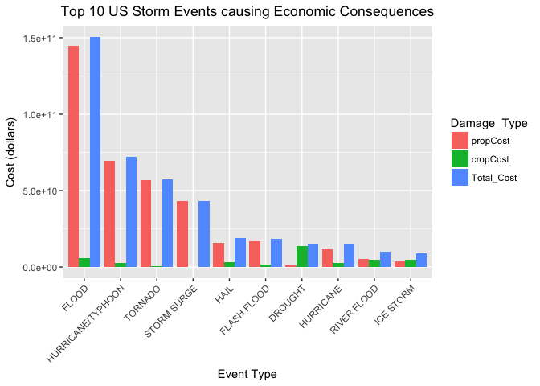

Github repo for the Course: [Reproducible Research](https://github.com/mGalarnyk/datasciencecoursera/tree/master/5_Reproducible_Research) </br> Github repo for Rest of Specialization: [Data Science Coursera](https://github.com/mGalarnyk/datasciencecoursera)

1: Synopsis
-----------

The goal of the assignment is to explore the NOAA Storm Database and explore the effects of severe weather events on both population and economy.The database covers the time period between 1950 and November 2011.

The following analysis investigates which types of severe weather events are most harmful on:

1.  Health (injuries and fatalities)
2.  Property and crops (economic consequences)

Information on the Data: [Documentation](https://d396qusza40orc.cloudfront.net/repdata%2Fpeer2_doc%2Fpd01016005curr.pdf)

2: Data Processing
------------------

### 2.1: Data Loading

Download the raw data file and extract the data into a dataframe.Then convert to a data.table

``` r
library("data.table")
library("ggplot2")

fileUrl <- "https://d396qusza40orc.cloudfront.net/repdata%2Fdata%2FStormData.csv.bz2"
download.file(fileUrl, destfile = paste0("/Users/mgalarny/Desktop", '/repdata%2Fdata%2FStormData.csv.bz2'))
stormDF <- read.csv("/Users/mgalarny/Desktop/repdata%2Fdata%2FStormData.csv.bz2")

# Converting data.frame to data.table
stormDT <- as.data.table(stormDF)
```

### 2.2: Examining Column Names

``` r
colnames(stormDT)
```

    ##  [1] "STATE__"    "BGN_DATE"   "BGN_TIME"   "TIME_ZONE"  "COUNTY"    
    ##  [6] "COUNTYNAME" "STATE"      "EVTYPE"     "BGN_RANGE"  "BGN_AZI"   
    ## [11] "BGN_LOCATI" "END_DATE"   "END_TIME"   "COUNTY_END" "COUNTYENDN"
    ## [16] "END_RANGE"  "END_AZI"    "END_LOCATI" "LENGTH"     "WIDTH"     
    ## [21] "F"          "MAG"        "FATALITIES" "INJURIES"   "PROPDMG"   
    ## [26] "PROPDMGEXP" "CROPDMG"    "CROPDMGEXP" "WFO"        "STATEOFFIC"
    ## [31] "ZONENAMES"  "LATITUDE"   "LONGITUDE"  "LATITUDE_E" "LONGITUDE_"
    ## [36] "REMARKS"    "REFNUM"

### 2.3: Data Subsetting

Subset the dataset on the parameters of interest. Basically, we remove the columns we don't need for clarity.

``` r
# Finding columns to remove
cols2Remove <- colnames(stormDT[, !c("EVTYPE"
  , "FATALITIES"
  , "INJURIES"
  , "PROPDMG"
  , "PROPDMGEXP"
  , "CROPDMG"
  , "CROPDMGEXP")])

# Removing columns
stormDT[, c(cols2Remove) := NULL]

# Only use data where fatalities or injuries occurred.  
stormDT <- stormDT[(EVTYPE != "?" & 
             (INJURIES > 0 | FATALITIES > 0 | PROPDMG > 0 | CROPDMG > 0)), c("EVTYPE"
                                                                            , "FATALITIES"
                                                                            , "INJURIES"
                                                                            , "PROPDMG"
                                                                            , "PROPDMGEXP"
                                                                            , "CROPDMG"
                                                                            , "CROPDMGEXP") ]
```

### 2.4: Converting Exponent Columns into Actual Exponents instead of (-,+, H, K, etc)

Making the PROPDMGEXP and CROPDMGEXP columns cleaner so they can be used to calculate property and crop cost.

``` r
# Change all damage exponents to uppercase.
cols <- c("PROPDMGEXP", "CROPDMGEXP")
stormDT[,  (cols) := c(lapply(.SD, toupper)), .SDcols = cols]

# Map property damage alphanumeric exponents to numeric values.
propDmgKey <-  c("\"\"" = 10^0,
                 "-" = 10^0, 
                 "+" = 10^0,
                 "0" = 10^0,
                 "1" = 10^1,
                 "2" = 10^2,
                 "3" = 10^3,
                 "4" = 10^4,
                 "5" = 10^5,
                 "6" = 10^6,
                 "7" = 10^7,
                 "8" = 10^8,
                 "9" = 10^9,
                 "H" = 10^2,
                 "K" = 10^3,
                 "M" = 10^6,
                 "B" = 10^9)

# Map crop damage alphanumeric exponents to numeric values
cropDmgKey <-  c("\"\"" = 10^0,
                "?" = 10^0, 
                "0" = 10^0,
                "K" = 10^3,
                "M" = 10^6,
                "B" = 10^9)

stormDT[, PROPDMGEXP := propDmgKey[as.character(stormDT[,PROPDMGEXP])]]
stormDT[is.na(PROPDMGEXP), PROPDMGEXP := 10^0 ]

stormDT[, CROPDMGEXP := cropDmgKey[as.character(stormDT[,CROPDMGEXP])] ]
stormDT[is.na(CROPDMGEXP), CROPDMGEXP := 10^0 ]
```

### 2.5: Making Economic Cost Columns

``` r
stormDT <- stormDT[, .(EVTYPE, FATALITIES, INJURIES, PROPDMG, PROPDMGEXP, propCost = PROPDMG * PROPDMGEXP, CROPDMG, CROPDMGEXP, cropCost = CROPDMG * CROPDMGEXP)]
```

### 2.6: Calcuating Total Property and Crop Cost

``` r
totalCostDT <- stormDT[, .(propCost = sum(propCost), cropCost = sum(cropCost), Total_Cost = sum(propCost) + sum(cropCost)), by = .(EVTYPE)]

totalCostDT <- totalCostDT[order(-Total_Cost), ]

totalCostDT <- totalCostDT[1:10, ]

head(totalCostDT, 5)
```

    ##               EVTYPE     propCost   cropCost   Total_Cost
    ## 1:             FLOOD 144657709807 5661968450 150319678257
    ## 2: HURRICANE/TYPHOON  69305840000 2607872800  71913712800
    ## 3:           TORNADO  56947380676  414953270  57362333946
    ## 4:       STORM SURGE  43323536000       5000  43323541000
    ## 5:              HAIL  15735267513 3025954473  18761221986

### 2.7: Calcuating Total Fatalities and Injuries

``` r
totalInjuriesDT <- stormDT[, .(FATALITIES = sum(FATALITIES), INJURIES = sum(INJURIES), totals = sum(FATALITIES) + sum(INJURIES)), by = .(EVTYPE)]

totalInjuriesDT <- totalInjuriesDT[order(-FATALITIES), ]

totalInjuriesDT <- totalInjuriesDT[1:10, ]

head(totalInjuriesDT, 5)
```

    ##            EVTYPE FATALITIES INJURIES totals
    ## 1:        TORNADO       5633    91346  96979
    ## 2: EXCESSIVE HEAT       1903     6525   8428
    ## 3:    FLASH FLOOD        978     1777   2755
    ## 4:           HEAT        937     2100   3037
    ## 5:      LIGHTNING        816     5230   6046

3: Results
----------

### 3.1: Events that are Most Harmful to Population Health

Melting data.table so that it is easier to put in bar graph format

``` r
bad_stuff <- melt(totalInjuriesDT, id.vars="EVTYPE", variable.name = "bad_thing")
head(bad_stuff, 5)
```

    ##            EVTYPE  bad_thing value
    ## 1:        TORNADO FATALITIES  5633
    ## 2: EXCESSIVE HEAT FATALITIES  1903
    ## 3:    FLASH FLOOD FATALITIES   978
    ## 4:           HEAT FATALITIES   937
    ## 5:      LIGHTNING FATALITIES   816

``` r
# Create chart
healthChart <- ggplot(bad_stuff, aes(x=reorder(EVTYPE, -value), y=value))

# Plot data as bar chart
healthChart = healthChart + geom_bar(stat="identity", aes(fill=bad_thing), position="dodge")

# Format y-axis scale and set y-axis label
healthChart = healthChart + ylab("Frequency Count") 

# Set x-axis label
healthChart = healthChart + xlab("Event Type") 

# Rotate x-axis tick labels 
healthChart = healthChart + theme(axis.text.x = element_text(angle=45, hjust=1))

# Set chart title and center it
healthChart = healthChart + ggtitle("Top 10 US Killers") + theme(plot.title = element_text(hjust = 0.5))

healthChart
```



### 3.2: Events that have the Greatest Economic Consequences

Melting data.table so that it is easier to put in bar graph format

``` r
econ_consequences <- melt(totalCostDT, id.vars="EVTYPE", variable.name = "Damage_Type")
head(econ_consequences, 5)
```

    ##               EVTYPE Damage_Type        value
    ## 1:             FLOOD    propCost 144657709807
    ## 2: HURRICANE/TYPHOON    propCost  69305840000
    ## 3:           TORNADO    propCost  56947380676
    ## 4:       STORM SURGE    propCost  43323536000
    ## 5:              HAIL    propCost  15735267513

``` r
# Create chart
econChart <- ggplot(econ_consequences, aes(x=reorder(EVTYPE, -value), y=value))

# Plot data as bar chart
econChart = econChart + geom_bar(stat="identity", aes(fill=Damage_Type), position="dodge")

# Format y-axis scale and set y-axis label
econChart = econChart + ylab("Cost (dollars)") 

# Set x-axis label
econChart = econChart + xlab("Event Type") 

# Rotate x-axis tick labels 
econChart = econChart + theme(axis.text.x = element_text(angle=45, hjust=1))

# Set chart title and center it
econChart = econChart + ggtitle("Top 10 US Storm Events causing Economic Consequences") + theme(plot.title = element_text(hjust = 0.5))

econChart
```


